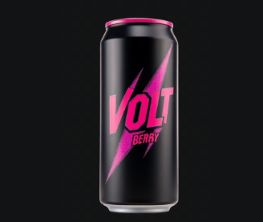
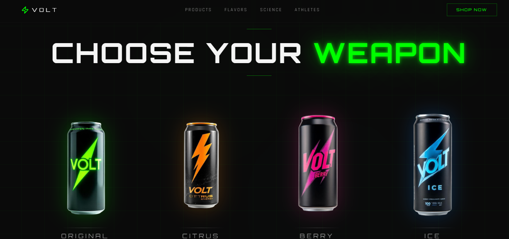
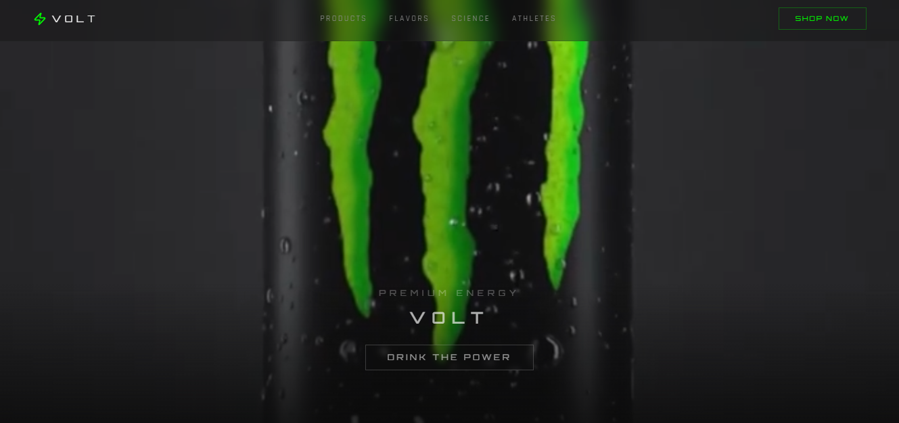

<p align="center">
  
</p>

# ⚡ VOLT Energy Drink — Unleash the Energy

A modern, responsive web application focused on clean energy awareness, innovation, and digital experience. Built with a sleek UI and performance-first approach, this project demonstrates real-world frontend development practices.

---

## 🌐 Live Demo

🔗(https://volt-energy-ignite-main.vercel.app/)

---

## 📌 Features

* ⚡ Modern and responsive UI
* 🌍 Clean energy themed design
* 🚀 Fast performance and smooth animations
* 📱 Mobile-friendly layout
* 🎨 Professional design structure

---

## 🛠️ Tech Stack

* HTML5 / CSS3 / JavaScript
* React (if used)
* Vite / Next.js (if applicable)
* Tailwind CSS (if used)

---

## 📂 Project Structure

```
├── src/
├── public/
├── components/
├── assets/
├── package.json
```

---

## 🚀 Getting Started

### 1. Clone the repository

```
git clone https://github.com/your-username/your-repo.git
```

### 2. Navigate to project

```
cd volt-energy-ignite-main
```

### 3. Install dependencies

```
npm install
```

### 4. Run locally

```
npm run dev
```

---

## 📸 Preview





---

## 🤝 Contributing

Feel free to fork this repository and improve the project.

---

## 📄 License

This project is open-source and available under the MIT License.

---

## 👩‍💻 Author

Developed by **Radhika Jayee**
email:radhikajayee@gmail.com
contact mo:9141919859

---
